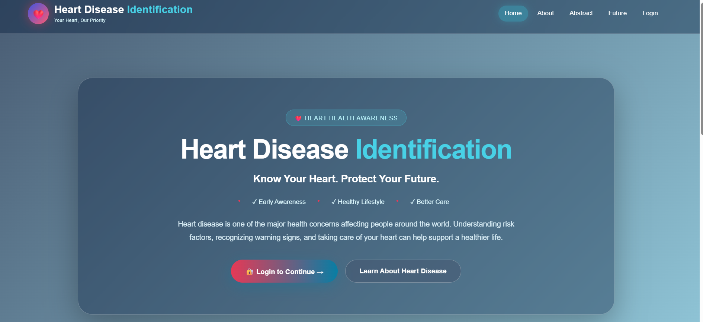
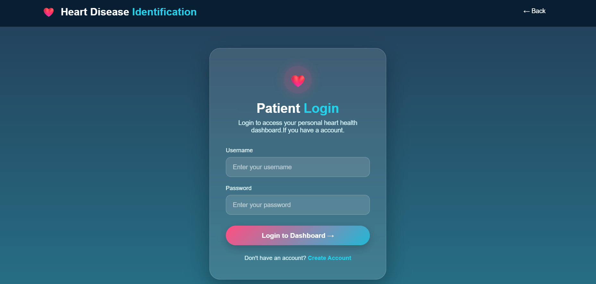
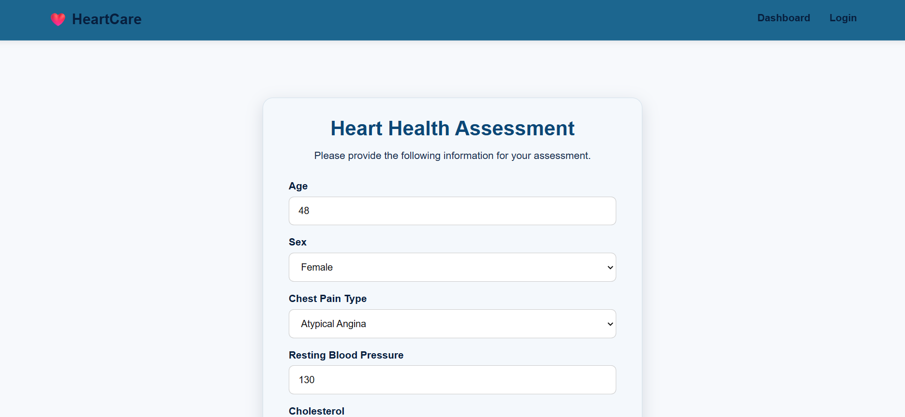
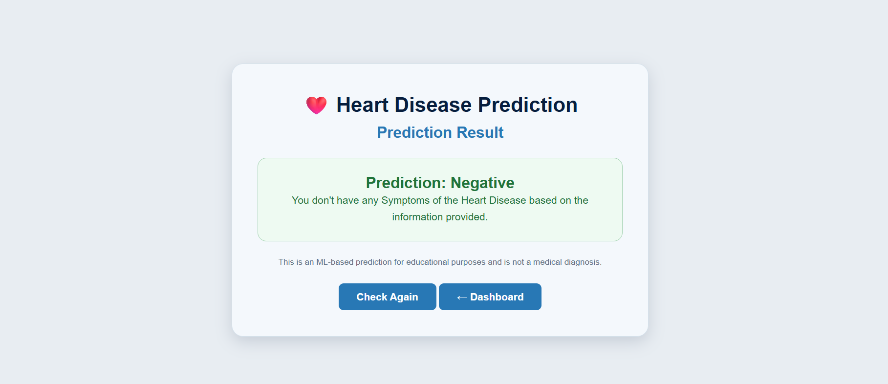

# Heart Disease Identification Using Machine Learning

## 📌 Project Overview

A Python-based web application that uses machine learning to identify the likelihood of heart disease based on selected patient health parameters.

The project includes a user interface for entering patient information and viewing prediction results, along with an admin section for viewing records and statistics.

## 🎯 Objectives

- Develop a simple heart disease identification application.
- Apply machine learning for classification.
- Store prediction records using MySQL.
- Provide user and admin functionality.

## 🛠️ Technologies Used

- Python
- Flask
- HTML, CSS, JavaScript
- Pandas, NumPy
- Scikit-learn
- Joblib
- MySQL

## 🤖 Machine Learning

Several classification models were evaluated:

| Model | Accuracy |
| --- | ---: |
| Logistic Regression | 91.67% |
| K-Nearest Neighbors | 90.00% |
| Random Forest | 88.33% |
| Decision Tree | 78.33% |

**Logistic Regression** achieved the highest test accuracy and was selected as the final model.

## 📊 Dataset

The project uses the **Cleveland Heart Disease Dataset**.

After data preparation, **297 records** were used for model development and evaluation.

The dataset contains health-related features such as age, gender, chest pain type, blood pressure, cholesterol, maximum heart rate, and other clinical attributes.

## ✨ Main Features

### User
- Login and registration
- Patient information entry
- Heart disease prediction
- Prediction result
- Previous records

### Admin
- Admin login
- Patient records
- Statistics
- Prediction charts

## 🗄️ Database

MySQL is used to store user and prediction records.

## 🖥️ Website Preview

### Home Page

### Login Page

### Prediction Page

### Result Page
